# Sakura-shop
# ---------------------------------------------------
## Case Study

#### Project Name: Sakura-shop.
#### Purpose: *Provide online food and beverage ordering service (Hamburger, chicken, bread, tea, coffee, milk tea).*
#### User object: *Who need to order food within HCM City.*
#### Features:
- User:
    - Sign in, sign up for the website.
    - See discount products at slider (HomePage).
    - See some shop statistics (number of customers, orders, dishes)
    - See all of products.
    - See list of products by categories.
    - Sort of products by price.
    - Search product by name.
    - See product information.
    - Comment product(Maybe don't have).
    - See related products(based on category).
    - Add product to cart.
    - Show all of products in cart.
    - Choose and buy products.
    - Register vip account to receive vouchers.
- Admin:
    - Customers information:
        - See all of user information.
        - Sort in some attributes.
        - Statistics of the number of users, VIP users, income from VIP.
    - Orders information:
        - Search orders by username.
        - Search order details by orderID.
        - See orders information, order details information.
        - Sort in some attributes.
        - Statistics of the number of order, products in order, total price, total promotion, total income.
    - Manage products:
        - See all of product information.
        - Add, update, remove products.
        - Add, update, remove products on sale.
        - Sort in some attributes.
    - Manage discount products:
        - See all of current discount orders.
        - Add, update, remove discount order.
        
    

## Wireframe or Screenshots of the system
- We have the sitemap of the system

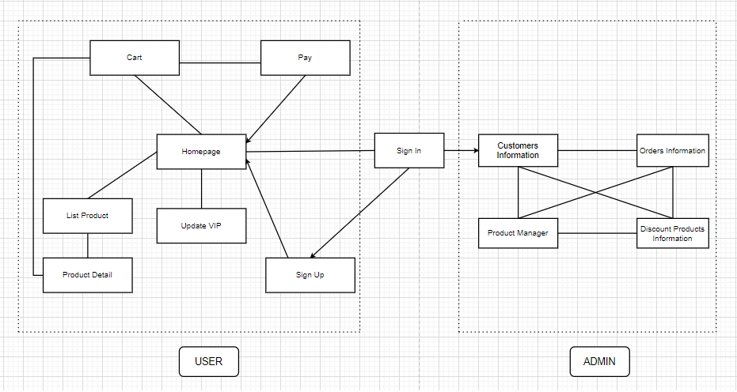
  
### 
*Admin------------------------------------------------------------------*
- Customers information:

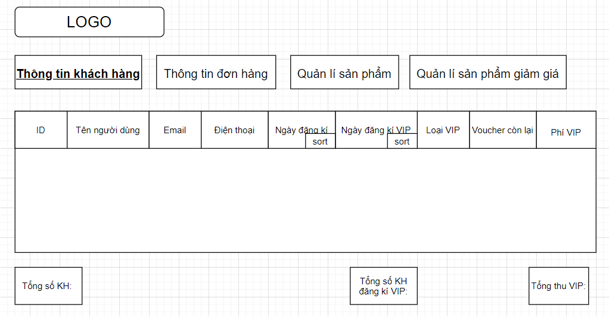

Here, you see the necessary information of customers.
  
- Orders information:

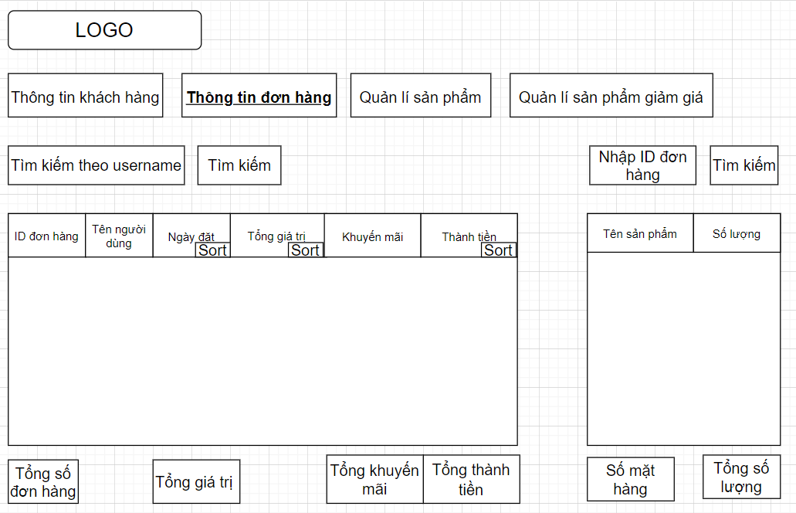

Here, you see the necessary information of orders.
  '
- Manage products:

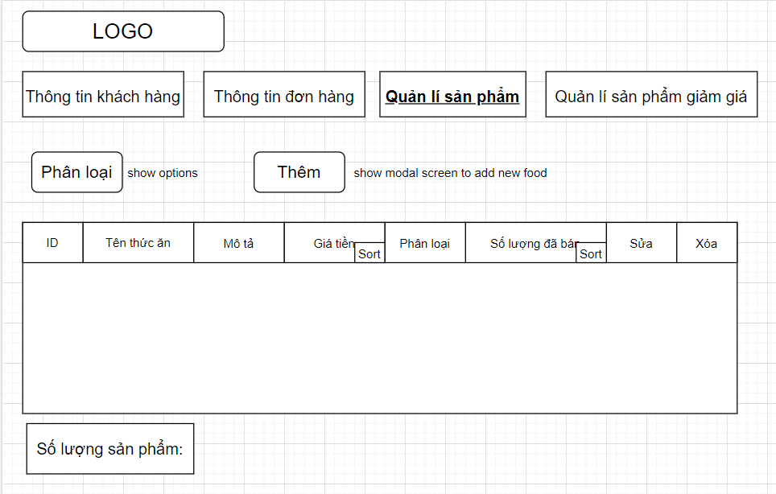

Here, you see the necessary information of products. Add, update or remove products information.
  
- Manage discount products:

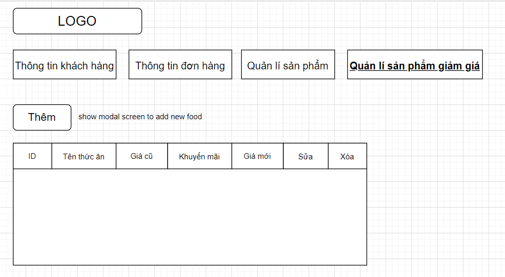

Here, you can see and add information of discount products.
  
### *User------------------------------------------------------------------*
- Firstly, you need to login by clicking ***Đăng nhập*** on header to order products.

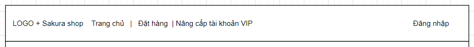
  
- The login form will appear. If you do not have an account, please select ***Đăng ký***.

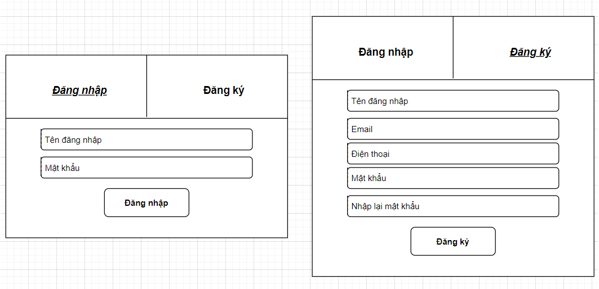
  

- After login, the system takes them to the Homepage by default. When the user is on another page in the system and clicks ***Home*** or Logo on the header, it will also return to the Homepage.

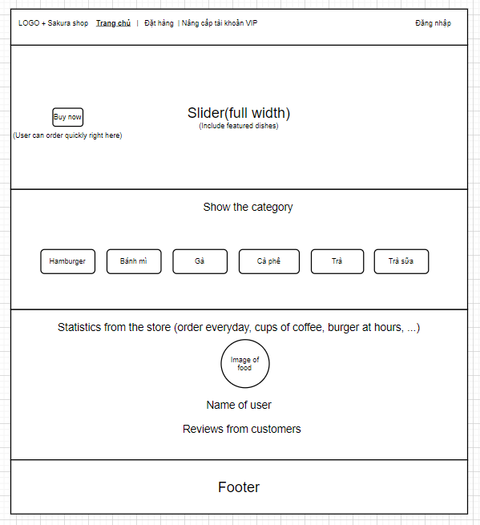
  

- When you click on ***Đặt hàng*** on the header, the web page will show:

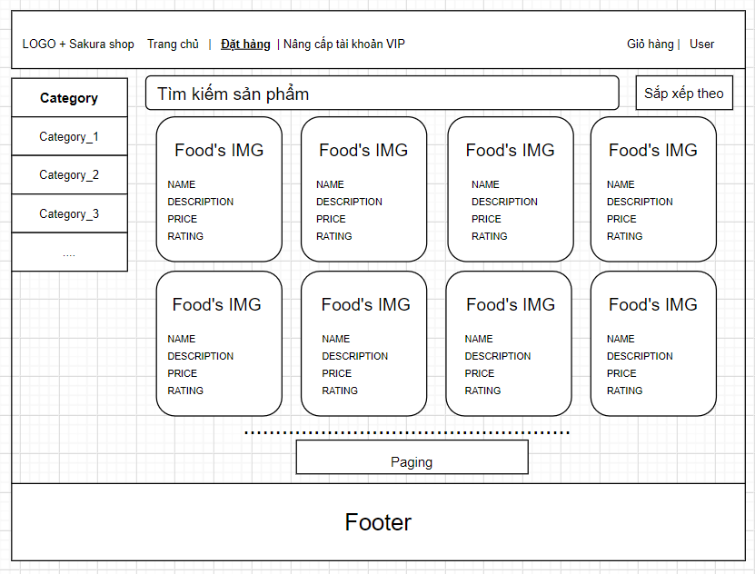

Here, you can choose the product you want to buy. You can also search by category by clicking on the left navigation, or by typing keywords in ***Tìm kiếm sản phẩm***, or by sorting products by price or quantity sold by clicking ***Sắp xếp theo***.
  
- After clicking on the product, The web page will display:

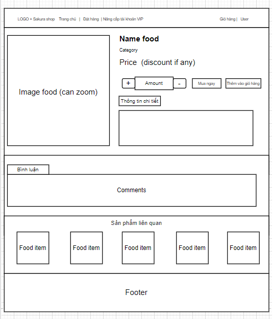
 
Here, you see more information about the product, you need to choose quantity, you can comment on the product. In addition, you can also refer to some related products. When you want to buy immediately, click ***Mua ngay***. Or click ***Thêm vào giỏ hàng*** when you want to buy more products.
  
- When you want to pay or see the cart. Please select ***Giỏ hàng*** on the header. The website will return:

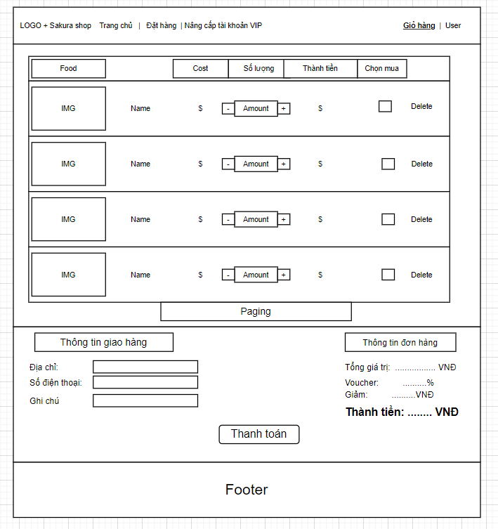

Here, you can see the products you have added, choose to buy or delete them. When you want to buy, you need to fill in the delivery information. 
  
- If you want more vouchers from the store, click on ***Nâng cấp tài khoản VIP*** on the header. The website will return:

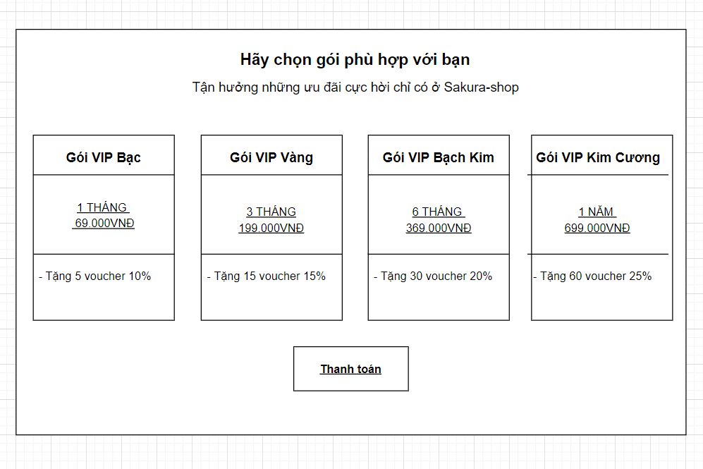

Now, you read the information and choose the right package for you(You can only register vip when not registered vip). Finally enjoy great moments with Sakura-shop."
    

## Database design

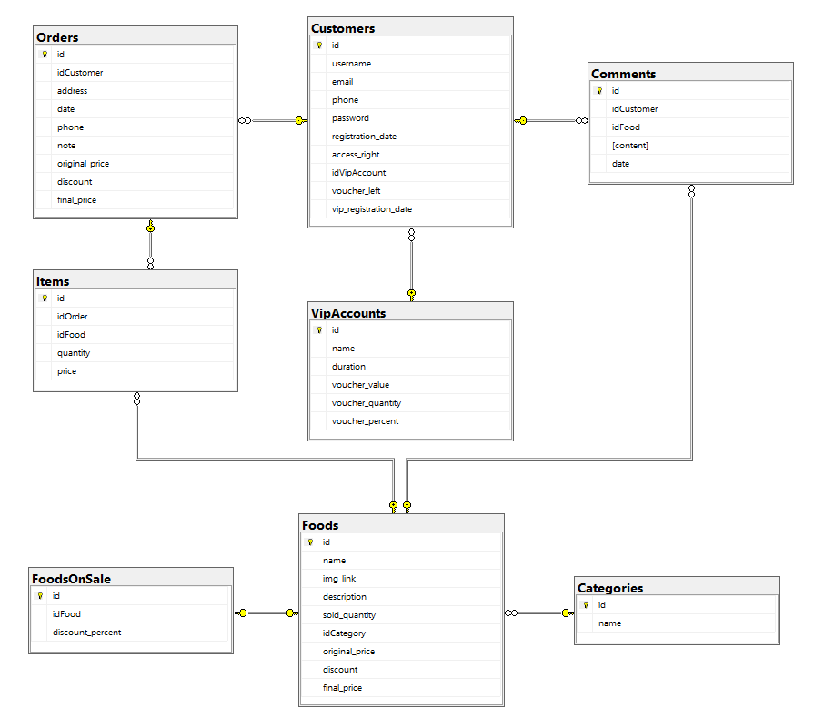
  

## System design

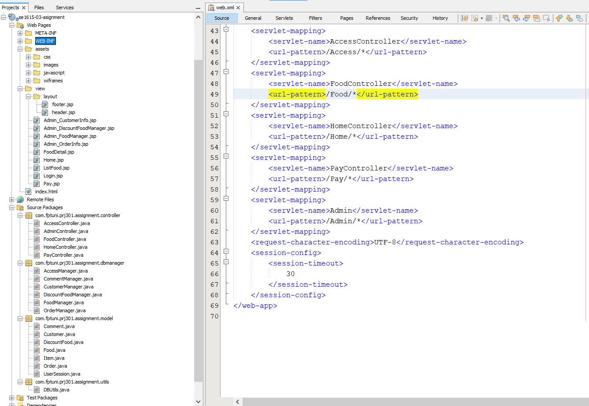

## Conclusion and Discussion

- Advantage: 
    - Interface is easy to use, friendly with user.
    - Relatively fully functional for buyers and sellers.
- Disadvantage: 
    - The design of properties and methods of a class is not good, so we have to use many db managers in the view (jsp) and performance is not good.
    - GUI design is not beautiful, not synchronized, does not include responsive.
    - UX has not improved well yet.
    - if admin has a few more functions it will be more convenient (Ex: search by name, by period, ... instead of just search by id).
    - The user also lacks a few functions: change personal information, redirect to food detail page when clicking on the product in the cart, ...
    - Reload the page when not needed.
- Through the development of this application: 
    - We learn a lot about teamwork. 
    - Realizing that making a sales website is also difficult.
    - Know how to use the MVC to connect the GUIs and the database.
- In the future, if having more time:
    - Redesign the classes in the model, GUIs not good (including responsive).
    - Add the necessary functions.
    - Study how to avoid page reloads.

